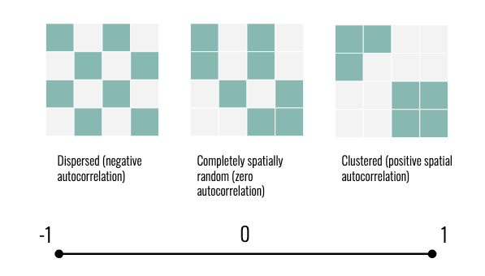
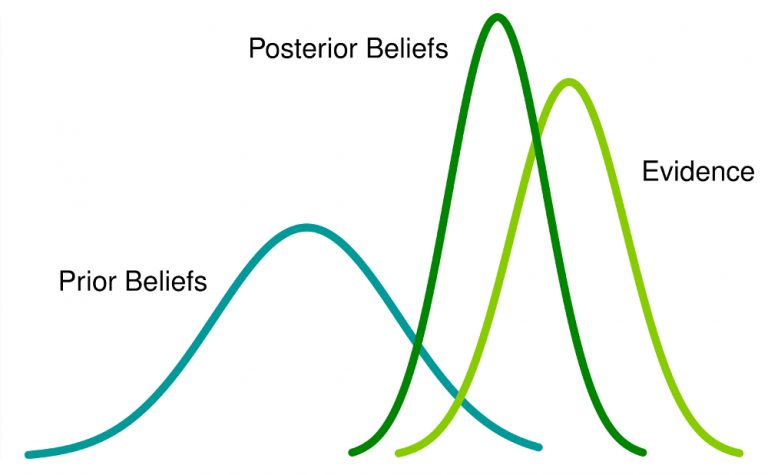
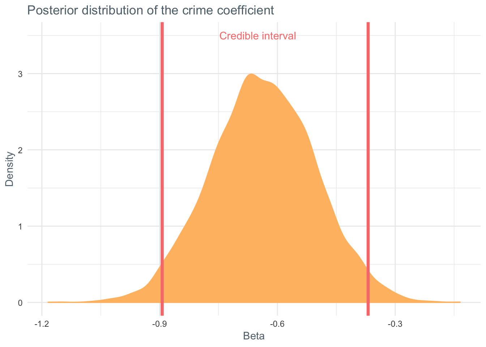

This is a tutorial on fitting spatial Bayesian models using the R package `CARBayes`. It was written in collaboration with [Katie Jolly](https://www.katiejolly.io/portfolio/) at Macalester! Here, we'll help walk you through how to start an analysis of spatial data using the `CARBayes` package. 

# Introduction to spatial data

Spatial data is everywhere. It can describe geography, demographics, epidemiology, and more. In fact, a lot of data we don’t always think of as spatial, such as voting records, can also be understood as describing variation across space. Unfortunately, spatial data breaks one of the fundamental assumptions of statistics--that individual observations are independent from one another. 

We know that spatial data isn’t independent intuitively: the price of housing or risk of contracting a disease in one county, for example, is likely related to the county next door. This understanding of spatial data allows us to borrow strength from neighbors in our analysis. If we’re missing data for a county, we can make some inference about the data we’re missing based on the counties around it. 

To appropriately model spatial data, we need to take this *spatial autocorrelation* into account. Spatial autocorrelation is generally represented as a value between -1 and 1, where 1 represents clustering and -1 represents dispersion. 




In this tutorial, we’ll use the hierarchical nature of spatial data to our advantage. Hierarchical data is data with some underlying structure. Common examples of hierarchical data are longitudinal data, were we have multiple observations on multiple subjects over time, or in our case, spatial data, where data inherits the spatial structure of geography. 


# Bayesian Methods

The methods we’ll use in this tutorial are drawn from Bayesian Statistics, which allow us to incorporate prior understanding of our data into our models. The idea of Bayesian methods is to reach a balance between our prior understandings and incoming information in the form of data. For more on Bayes, check out [this article!](https://www.analyticsvidhya.com/blog/2016/06/bayesian-statistics-beginners-simple-english/) 




Bayesian methods are particularly suited to modelling hierarchical data because we can account for the hierarchy using our priors. For example, a simple hierarchical model might say that the percent of a county who voted for Trump in the 2016 election is centered around a different mean value for each state (top layer of the model) and the mean value for each state is based on some other parameters, such as median income (priors). 

# Conditional autoregressive models

In this tutorial, we’ll fit conditional autoregressive (CAR) models. These are Bayesian models used to describe data in non-overlapping areal units, such as counties or states. CAR models are often used to model things like disease rates or ecological phenomena, but they can also be used to model housing prices, for example. 

If $Y_i$ is the response for area $i$ and $x_i$ is a set of covariates or characteristics in the $i$th area, the formal model statement is as follows:


`$$
\begin{aligned}
E(Y_i |  Y_j, j\not= i) &= x_i^T\beta + \sum^n_{j=1}c_{ij}(Y_j - x^T_j\beta) \\\\\\
Var(Y_i |  Y_j, j\not= i) &= \tau^2_i = \tau^2/w_{i.}
\end{aligned}
$$`


where `$w_{i.} = \sum^n_{j=1}w_{ij}$`, `$c_{ij}$` is nonzero only if `$Y_j \in N_i$`, and $N_i$ is the neighborhood of `$Y_i$`. `$c_{ij}$` is typically `$\lambda w_{ij}/w{i}$`. 

In this tutorial, we’ll fit one of the most simple (and flexible) CAR models. This model is a Gaussian Markov random field (GMRF) model proposed by Besag (we’ll refer to it as the Besag model). If you’re familiar with time series models, the most basic GMRF is the AR(1) process. In simple terms, a Gaussian random field is a random function over space with Gaussian probability distributions. A Gaussian *Markov* random field means that we are only interested in locations one “step” away from our current location -- in this context of spatial data, this means that we’re interested in neighbors which directly share a boundary. 

The Besag model generally looks like a random effects model: 

`$$
\begin{aligned}
log(\hat Y) &=\mu+z_i^T\beta + b_i \\
\mu &= \text{global mean} \\
z_i\beta_i &= \text{vector of covariates & corresponding coefficient} \\
b_i &= \text{spatial random effect}
\end{aligned}
$$`

When we define a prior distribution the default is often as follows: 

`$$
\mu \sim N(0, \frac{1}{100^2}) \\
\beta \sim N(0, \frac{1}{100^2}) \\
b_i \sim \text{some spatial dependency model}
$$`

The Besag model considers `$b_i$` to be normally distributed with the mean being a function of the neighboring values, the set `$\delta i$` and the variance proportional to the number of neighbors, `$n_{\delta i}$`. In notation, it looks like this:

`$$
\begin{aligned}
b_i|b_{-i}, \tau_b &\sim N(\frac{1}{n_{\delta i}}\sum_{j \in \delta i}b_j, \frac{1}{n_{\delta i} \tau_b}) \\
\tau_b &= \text{precision parameter}\\
b_{-i} &= (b_1, ... b_{i-1}, b_{i+1},...,b_n)^T
\end{aligned}
$$`

There are several natural progressions from the Besag model. For more accurate parameter estimates in the case of overdispersion (excessive variance) or unstructured errors (errors with no spatial autocorrelation), we can use the Besag-York-Mollíe model. Further, to account for spatial autocorrelation and overdispersion with two separate parameters, we can use the Leroux model. More information on each of these models can be found [here](https://arxiv.org/pdf/1601.01180.pdf?fbclid=IwAR3dKo4uDNweY-otyPAMKnBa99RLt7sPMtEi-Kd2UIx8gkcpas6OuZ84jqs). 


# Data and packages

We'll fit these models using the `CARbayes` package in R. This package allows us to fit several univariate and multivariate CAR models and make inference in a Bayesian context using Markov chain Monte Carlo (MCMC) simulations. The package supports response variable from Gaussian, multinomial, Poison (or count), and zero-inflated Poisson distributions. Spatial autocorrelation is modeled using random effects in most cases, and each function in the package corresponds to a different prior or model type. Reacall we'll be using Besag priors, which assume a constant degree of spatial autocorrelation among the observations. The random effects are distributed normally around the mean of the neighbors and the variance is proportional to the size of the neighborhood. There is a lot of potential complexity built into the `CARbayes` package but for this tutorial, we’ll focus on simple application and interpretation!


You'll need the packages below to run this tutorial on your own. This code chunk makes sure that all of the packages are installed and loaded!

```{r}
packages <- c("CARBayes", "sf", "tidycensus", "janitor", "tidyverse", "spData", "spdep")

miss_pkgs <- packages[!packages %in% installed.packages()[,1]]

if(length(miss_pkgs) > 0){
  install.packages(miss_pkgs)
}

invisible(lapply(packages, library, character.only = TRUE))

rm(miss_pkgs, packages)
```

We will use a [shapefile of Columbus, OH neighborhoods](https://rdrr.io/cran/spData/man/columbus.html) from the `spData` package. In total there are 49 neighborhoods and 22 variables and the data is from 1980. 


```{r results='hide'}
columbus <- columbus_sf <- st_read(system.file("shapes/columbus.shp", package="spData")[1])
```

It includes a variety of characteristics about the homes and people in each neighborhood. 

| Variable | Description                                                       |
|----------|-------------------------------------------------------------------|
| NEIG     | neighborhood id value (1-49)                                      |
| HOVAL    | median housing value (in $1,000)                                         |
| INC      | household income (in $1,000)                                      |
| CRIME    | number of residential burglaries and vehicle thefts per thousand households |
| OPEN     | open space in neighborhood (mi^2)                                        |
| PLUMB    | percentage housing units without plumbing                         |
| DISCBD   | distance to the central business district (miles)                         |


We will model the relationship between crime `CRIME` and home value `HOVAL`. In order to see whether or not spatial models are a necessary complexity, we will do some exploratory data analysis. If we do not see clear spatial patterns, we can use Generalized Linear Models and do not need to account for the spatial autocorrelation. 

The first step in our exploration is to plot maps of our variables of interest.

```{r}
map_theme <- theme_minimal() + theme(text = element_text(color = "#60717a"), panel.grid = element_line("transparent"), axis.text = element_blank()) 

map_colors <- scale_fill_gradientn(colors = c("#FFBD71", "#FCA464", "#F87D7B", "#D04A73"), na.value = "#e1e5e8")

ggplot(columbus) +
  geom_sf(aes(fill = HOVAL)) +
  map_theme +
  map_colors +
  labs(title = "Median home values in Columbus, OH neighborhoods, 1980", fill = "Home value in 1,000s")
```


```{r}
ggplot(columbus) +
  geom_sf(aes(fill = CRIME)) +
  map_theme +
  map_colors +
  labs(title = "Residential crime in Columbus, OH neighborhoods, 1980", fill = "Residential burglaries and vehicle \nthefts per thousand households")
```


In these maps we can see two different important characteristics. First, it looks like there is spatial clustering for each of the variables individually. We will quantify this with Moran's I. Second, we see an inverse relationship between these two variables. In context, this means that high home values and low residential crime rates are often found in the same neighborhood. 

Before fitting a model, we will test the degree of spatial correlation with Moran's I. A priori we can see that the pattern is likely clustering rather than dispersion, so we'll conduct a one-tailed hypothesis test to see if the clustering is greater than random. 
 


$$H_O: \text{no spatial clustering} \\
H_A: \text{spatial clustering}$$


```{r}
col_sp <- as(columbus, "Spatial")
col_nb <- poly2nb(col_sp) # queen neighborhood
col_listw <- nb2listw(col_nb, style = "B") # listw version of the neighborhood
W <- nb2mat(col_nb, style = "B") # binary structure
moran.mc(col_sp$HOVAL, listw = col_listw, nsim = 999, alternative = "greater") # moran's I test HOVAL


# Monte-Carlo simulation of Moran I
# 
# data:  col_sp$HOVAL 
# weights: col_listw  
# number of simulations + 1: 1000 
# 
# statistic = 0.22134, observed rank = 991, p-value = 0.009
# alternative hypothesis: greater
```


For home value, the `moran.mc` functionr returns a test statistic of 0.22134 (moderate positive correlation) and based on our Monte Carlo simulations of possible random patterns we have a p-value of 0.008. We reject the null hypothesis because there is substantial evidence of spatial clustering. Now we will repeat this process for crime. If both of these show evidence of clustering then we know we should use spatial models.

```{r}
moran.mc(col_sp$CRIME, listw = col_listw, nsim = 999, alternative = "greater") # moran's I test CRIME

# Monte-Carlo simulation of Moran I
# 
# data:  col_sp$CRIME 
# weights: col_listw  
# number of simulations + 1: 1000 
# 
# statistic = 0.51546, observed rank = 1000, p-value = 0.001
# alternative hypothesis: greater
```

For crime, the test statistic is 0.51546 (strong clustering) and based on our Monte Carlo simulations we have a p-value of 0.001. We reject the null hypothesis because there is substantial evidence of spatial relationships.

## Spatial models

In order to better quantify the relationship between these two variables accounting for their spatial structure we will use the models proposed by Besag and implemented in `CARbayes`. In order to run these models, we will use the weights matrix `W` defined above and model `HOVAL` by `CRIME` from the `columbus` data. In this model we assume a fixed spatial dependence parameter $\rho = 1$ which simplifies the Leroux model to a Besag model (both can be fit using the same function). This model takes around 30 seconds to fit.

```{r include = FALSE}
model.hoval <- CARBayes::S.CARleroux(HOVAL ~ CRIME, data = columbus, W = W, family = "gaussian", burnin = 20000, n.sample = 100000, thin = 10)
```


```{r}
model.hoval

# #################
# #### Model fitted
# #################
# Likelihood model - Gaussian (identity link function) 
# Random effects model - Leroux CAR
# Regression equation - HOVAL ~ CRIME
# Number of missing observations - 0
# 
# ############
# #### Results
# ############
# Posterior quantities and DIC
# 
#               Median     2.5%    97.5% n.effective Geweke.diag
# (Intercept)  60.6232  50.5268  70.5352      7684.7        -0.6
# CRIME        -0.6338  -0.8887  -0.3754      8000.0         0.6
# nu2         226.4746 157.6672 346.1224      7527.6         1.1
# tau2          0.0084   0.0021   0.0962      1261.3        -0.9
# rho           0.3730   0.0170   0.9148      3293.0         1.0
# 
# DIC =  410.0037       p.d =  2.895076       LMPL =  -205.92 
```


In a Bayesian analysis we are simulating values from the posterior distribution of our parameters. If the middle 95% of distribution (the credible interval) does not cross zero then we can say it is a significant predictor. In this case we are looking at the `CRIME` parameter and we can see that the credible interval is below 0, meaning there is a significant negative or inverse relationship between crime and home value. The median value of the posterior distribution for `CRIME` is -0.715, meaning that for every crime recorded in that neighborhood the home value (in thousands) decreases by 0.715. Contextually, this makes sense. If we wanted to compare this model to others, we would use the DIC value, which is 97.4. We would select the model with the lower DIC, but this method is only applicable when the posterior distribution is approximately multivariate normal.

We can extract all of the simulated $\beta_\text{crime}$ coefficients and plot them to see the distribution.

```{r}
cbus_sim <- data_frame(beta_crime = as.vector(model.hoval$samples$beta[,2]))

ggplot(cbus_sim, aes(x = beta_crime)) +
  geom_density(fill = "#FFBD71", color ="#FFBD71") + 
  geom_vline(xintercept = -0.8936, color = "#F87D7B", size = 1.5) +
  geom_vline(xintercept = -0.3690, color = "#F87D7B", size = 1.5) + 
  annotate("text", x = -0.65, y = 3.5, label = "Credible interval", color = "#F87D7B") + 
  theme_minimal() +
  theme(text = element_text(color = "#60717a")) +
  labs(title = "Posterior distribution of the crime coefficient", x = "Beta", y = "Density")
```



This is a good visual representation of the credible interval; we can see that our coefficient will almost never be 0!

## Evaluating the spatial pattern of residuals

We also want to test to make sure our residuals aren't clustered. If they are, that means we are missing an important confounding variable. We can check for this clustering with the same Moran's I test on our residual.

```{r}
moran.mc(x = as.vector(model.hoval$residuals$response), listw = col_listw, nsim = 9999, alternative = "greater")

# Monte-Carlo simulation of Moran I
# 
# data:  as.vector(model.hoval$residuals$response) 
# weights: col_listw  
# number of simulations + 1: 10000 
# 
# statistic = 0.17135, observed rank = 9819, p-value = 0.0181
# alternative hypothesis: greater
```

In this example we do see slight clustering in our residuals (I = 0.17), but that is likely because we only used one covariate to describe home patterns. In later iterations we would include more covariates in the model. We can also map the residuals to see where these clusters appear.

```{r}
columbus %>%
  mutate(resid = model.hoval$residuals$response) %>%
  ggplot(aes(fill = resid)) +
  geom_sf() + 
  map_theme +
  map_colors +
  labs(title = "Residuals from the CAR model", subtitle = "home value ~ crime", fill = "Residual")
```


In order to choose our next covariate, we can start by thinking about what kinds of variables might explain this pattern in the residual. One idea might be to include distance to the Central Business District!

# Discussion

The model we’ve fit in this tutorial are a great place to start with Bayesian CAR models. The Besag model gives us fairly familiar results: coefficients which we can interpret just as we might in a more basic linear regression context. However, it gives more accurate predictions because it accounts for the underlying structure in the data. There are many layers of complexity we can add to make these models do more for us. Many of those improvements simply require adding new parameters or constraints to the Besag model!

One limitation of these CAR models is that they are parametric. This could be a strength or a limitation depending on the data we’re interested in! The methods are also computationally expensive -- when working with large amounts of data or covariates, a single model can take several minutes to run. This is less a weakness of the methodology and more a symptom of working with complex spatial data. 

As a package, `CARBayes` is incredibly versatile. There are several other models and corresponding functions in the package which we haven’t discussed, so if the models presented here don’t fit your needs, check out the [vignette](https://cran.r-project.org/web/packages/CARBayes/vignettes/CARBayes.pdf)! If you've got any other questions, feel free to reach out!
