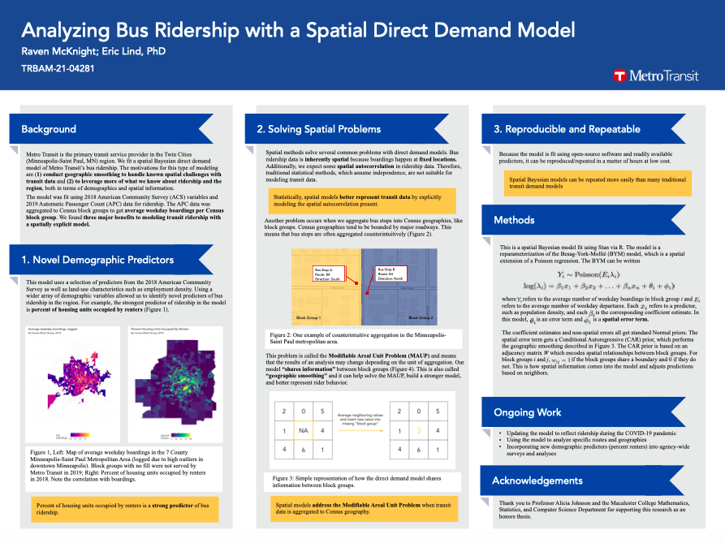

This January, I got to present a poster about a spatial Bayesian direct demand model of bus ridership at the Transportation Review Board conference. This research began as my honors thesis at Macalester College and grew into this research for Metro Transit. You can see a full size copy of the poster [here!](https://www.ravenmcknight.com/files/TRB-poster.pdf)

I've been working on this project for well over a year now, so it was great to finally present the results to a larger audience! Feel free to reach out if you'd like to hear more about the model or its applications!

