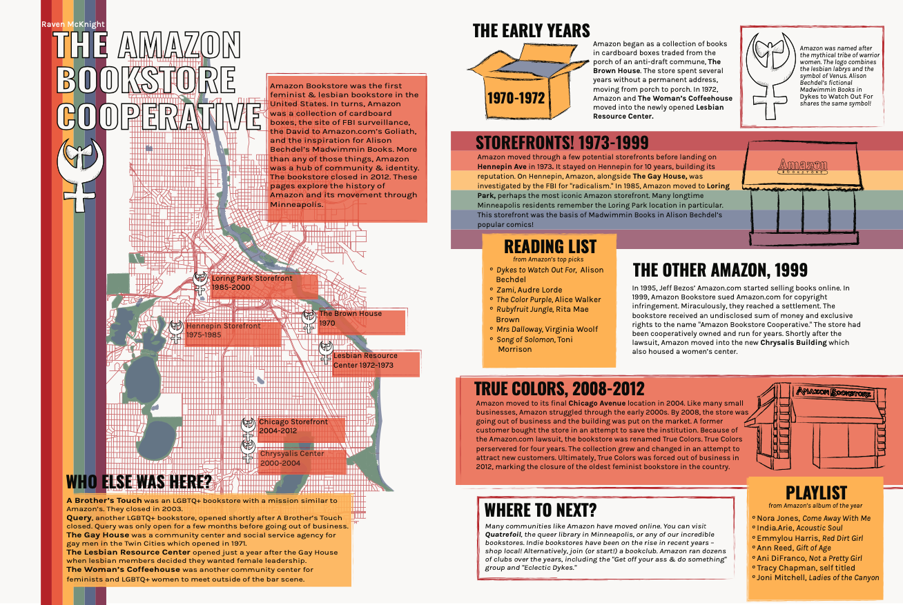

In the spring of 2020, I got to take a class called Cultural Atlas Production at Macalester. Inspired by cartographers like Rebecca Solnit, and Macalester's [2019 cultural atlas of Saint Paul](https://issuu.com/maccarto/docs/curiouscity), the class created a cultural atlas of Minneapolis!

My spread focused on The Amazon Bookstore Cooperative, the oldest lesbian bookstore in the country. It existed in Minneapolis from the early 1970s until it closed in 2012. 

Like so many things, this project was affected by COVID-19 when lockdown began. Despite those challenges, I'm so impressed with everything my classmates created. You can see the whole cultural atlas and read more about the project [here](https://www.macalester.edu/news/2020/08/meandering-minneapolis/)!

