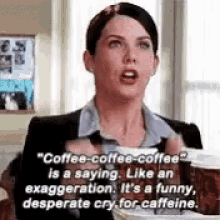

I was recently inspired by Alyssa Fowers [visualization](https://twitter.com/alyssafowers/status/1178335347538825217) of her fall semester coffee consumption. I tracked my own coffee-drinking data for a month to create this plot!

It was fun to see where I drank abnormal amounts of coffee, or coffee at abnormal times -- like the office hours I hold on Mondays at 7pm or during my trip to DC towards the end of the month. I was also surprised by how much the time of my first coffee varied -- I definitely expected to see a stronger "6am coffee" pattern. 

I created this plot with `ggplot2`, Illustrator, and a Gilmore Girls reference for good measure. What would a coffee viz be without Lorelai, after all? 

Code for the plot is on my [Github](https://github.com/ravenmcknight/visualization/tree/master/october_in_coffee). Here's to sleeping more in November!

 
 
 