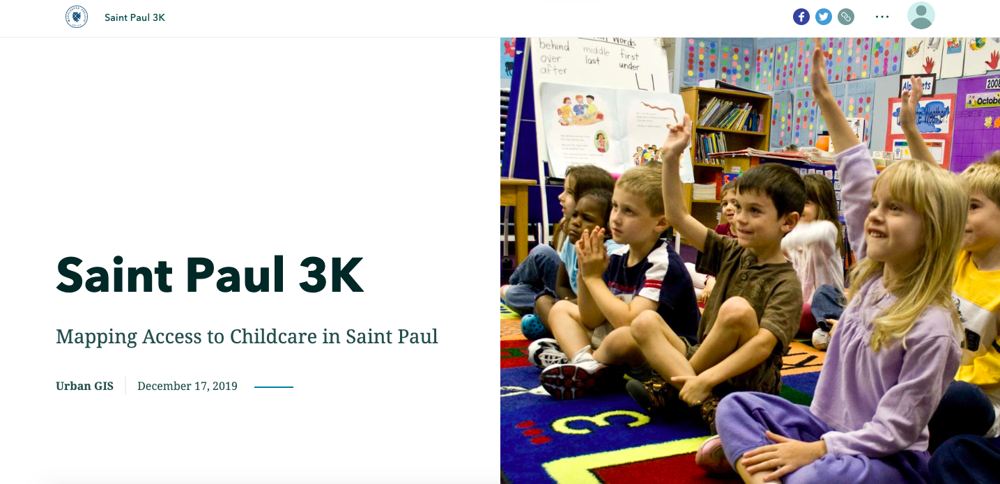

This StoryMap was created in collaboration with my Urban GIS class at Macalester. The class consists of a semester-long project supporting a community partner -- in our case, Saint Paul City Councilmember Rebecca Noeker and the Saint Paul 3K Initiative. 

The goal of Saint Paul 3K is to provide affordable, accessible childcare to all 3- and 4-year olds in Saint Paul. This is the second time Urban GIS has partnered with Councilmember Noeker. Our work focused on **primary data collection** and **identifying barriers to care** across Saint Paul. Check out the full StoryMap [here](https://storymaps.arcgis.com/stories/0350ab8ab7824256a4bfd3eef012eb74)!

